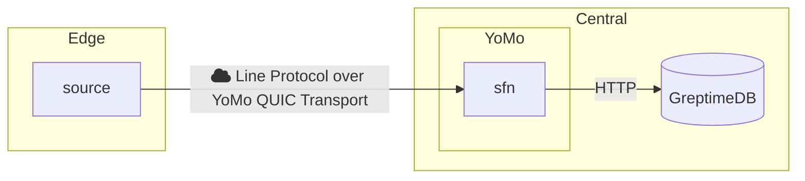

# GreptimeDB x Yomo

> Boost your GreptimeDB performance with YoMo: Leverage QUIC for rapid and reliable data ingestion.

This repository showcases how to utilize
[GreptimeDB](https://github.com/GreptimeTeam/greptimedb) for data transportation
via [YoMo](https://github.com/yomorun/yomo). We will use Yomo's fast and
reliable QUIC transport to send local IoT or Observability metrics data to a
remote function that ingests the data into time-series database, GreptimeDB.



## Run this demo

0. Clone this reposiotry

```bash
git clone https://github.com/yomorun/GreptimeDB-YoMo.git
cd GreptimeDB-YoMo
```

1. Install GreptimeDB (This example uses Docker. For additional installation methods, refer to the [GreptimeDB documentation](https://docs.greptime.com/getting-started/installation/overview)).

```bash
docker run -p 127.0.0.1:4000-4003:4000-4003 \
-v "$(pwd)/greptimedb:/tmp/greptimedb" \
--name greptime --rm \
greptime/greptimedb:v0.8.2 standalone start \
--http-addr 0.0.0.0:4000 \
--rpc-addr 0.0.0.0:4001 \
--mysql-addr 0.0.0.0:4002 \
--postgres-addr 0.0.0.0:4003
```

2. Install YoMo

```bash
curl -fsSL https://get.yomo.run | sh
```

3. Start yomo zipper service

```bash
yomo serve -c config.yaml
```

4. Run yomo sfn, sfn bridges GreptimeDB and YoMo

```bash
cd sfn && GREPTIMEDB_HTTP_ADDR=localhost:4000 yomo run app.go
```

5. Start the log generator, this will generate ingest data in Line Protocol format and send it to the YoMo zipper service over QUIC.

```bash
# This sample shows how to monitor the cpu
go run source/main.go
# This sample shows how to monitor the gpu
go run gpu-source/main.go
```

6. Verify that the data has been successfully written to GreptimeDB.

```bash
curl -X POST \
  -H 'Content-Type: application/x-www-form-urlencoded' \
  -d 'sql=select * from monitor' \
http://localhost:4000/v1/sql?db=public
```
