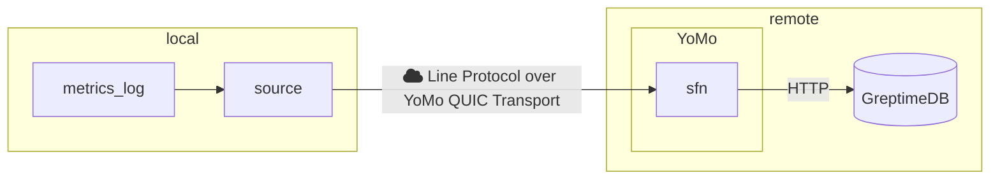

# GreptimeDB x Yomo

> Boost your GreptimeDB performance with YoMo: Leverage QUIC for rapid and reliable data ingestion.

This repository showcases how to utilize GreptimeDB for data transportation via
YoMo. We will use Yomo's fast and reliable QUIC transport to send local IoT or
Observability metrics data to a remote function that ingests the data into
time-series database, GreptimeDB.



## Run this demo

0. Clone this reposiotry

```bash
git clone https://github.com/yomorun/GreptimeDB-YoMo.git
cd GreptimeDB-YoMo
```

1. Install GreptimeDB (This example uses Docker. For additional installation methods, refer to the [GreptimeDB documentation](https://docs.greptime.com/getting-started/installation/overview)).

```bash
docker run -p 127.0.0.1:4000-4003:4000-4003 \
-v "$(pwd)/greptimedb:/tmp/greptimedb" \
--name greptime --rm \
greptime/greptimedb:v0.8.2 standalone start \
--http-addr 0.0.0.0:4000 \
--rpc-addr 0.0.0.0:4001 \
--mysql-addr 0.0.0.0:4002 \
--postgres-addr 0.0.0.0:4003
```

2. Install YoMo

```bash
curl -fsSL https://get.yomo.run | sh
```

3. Start yomo zipper

```bash
yomo serve -c config.yaml
```

4. Run yomo sfn, sfn bridges GreptimeDB between YoMo

```bash
cd sfn && GREPTIMEDB_HTTP_ADDR=localhost:4000 yomo run app.go
```

5. Execute the YoMo source. This source monitors a file and streams any new content to the zipper.

```bash
go run source/main.go -f metric.log
```

The source is now configured to write Line Protocol data to `metric.log`. This data, transmitted over the QUIC Protocol, will be seamlessly ingested by GreptimeDB.

6. We provide a bash script to generate data for `metric.log`.

```bash
bash metric_ingest.sh
```

7. Verify that the data has been successfully written to GreptimeDB.

```bash
curl -X POST \
  -H 'Content-Type: application/x-www-form-urlencoded' \
  -d 'sql=select * from monitor' \
http://localhost:4000/v1/sql?db=public
```
